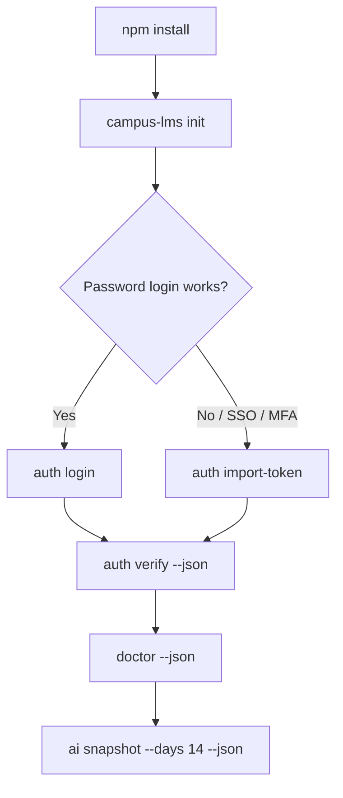

# campus-lms-cli

`campus-lms-cli` は、大学の Moodle 互換 LMS を CLI から参照するための
**読み取り専用向けツール**です。  
ユーザー本人が閲覧可能な情報を、AI やスクリプトが扱いやすい形で取得できます。

## 方針

- **Read-only by default**: 課題提出、削除、編集、投稿、完了状態変更などの副作用は実装しません。
- `--json` 連携を前提に、機械可読の出力を第一級で扱います。
- 認証情報は必要最小限のみ保存し、秘密情報は画面出力しません。

## インストール

### npm で入れる

GitHub から直接インストールできます。

```bash
npm install -g --install-links=true github:Aero123421/campus-lms-CLI
campus-lms init
campus-lms auth status --json
```

`npm install -g github:...` が `npm/postinstall.js` を見つけられず失敗する環境では、npm の GitHub global install のリンク方式が原因です。上の `--install-links=true` 付きコマンドを使ってください。

それでも失敗する場合は、GitHub の tarball URL から直接インストールできます。

```bash
npm install -g https://github.com/Aero123421/campus-lms-CLI/archive/refs/heads/main.tar.gz
```

リポジトリを clone して試す場合は以下です。

```bash
git clone https://github.com/Aero123421/campus-lms-CLI.git
cd campus-lms-CLI
npm install
npx campus-lms capabilities
```

通常の npm install では、同梱済みまたは GitHub Releases の prebuilt binary を使います。利用者側に Rust toolchain は不要です。

Windows で `campus-lms` が見つからない場合は、新しい PowerShell を開き直してください。それでも見つからない場合は、npm の global bin である `%APPDATA%\npm` が PATH に入っているか確認します。

```powershell
npm prefix -g
$env:Path -split ';' | Select-String npm
```

### アップデート

```bash
npm install -g --install-links=true github:Aero123421/campus-lms-CLI
```

### アンインストール

```bash
campus-lms uninstall --yes
npm uninstall -g campus-lms-cli
```

GitHub から直接入れた場合も、npm の global package 名は通常 `campus-lms-cli` です。

## 開発者向けビルド

Rust toolchain がある場合はソースからビルドできます。

```bash
cargo build --release
cargo test
```

配布用 prebuilt binary を作る場合:

```bash
npm run build:native
npm run prepare:prebuilt
npm pack
```

GitHub Releases には `campus-lms-v<version>-<platform>` と `.sha256` を置きます。`postinstall` は checksum を検証してから binary を配置します。

## 主要コマンド

- `campus-lms auth login`  
  LMS との接続情報を登録し、token を OS credential store に保存して読み戻し確認
- `campus-lms auth import-token`
  SSO/MFA 環境などで発行済み Web Services token を保存
- `campus-lms auth status --live --json`
- `campus-lms auth verify --json`
- `campus-lms doctor --json`
- `campus-lms whoami --json`
- `campus-lms courses --json`
- `campus-lms todo --days 14 --json`
- `campus-lms todo --days 14 --max-items 5 --json`
- `campus-lms assignment show <assignment_id> --json`
- `campus-lms ai snapshot --days 14 --max-items 5 --json`
- `campus-lms capabilities --json`
- `campus-lms schema list --json`
- `campus-lms errors --json`
- `campus-lms ai instructions`
- `campus-lms init`
- `campus-lms cleanup --cache --dry-run`
- `campus-lms uninstall --dry-run`

## 初期化とアンインストール

初回セットアップでは、秘密情報を含まない config と cache ディレクトリだけを作成できます。

```bash
campus-lms init
campus-lms auth login
```

ローカルデータを消す場合は、対象を明示します。実削除前に確認プロンプトが出ます。

```bash
campus-lms cleanup --cache --dry-run
campus-lms cleanup --local-config --dry-run
campus-lms cleanup --all --yes
```

`uninstall` は token / config / cache の削除を行い、npm パッケージ本体の削除コマンドを案内します。npm パッケージ自体を CLI が勝手に削除することはありません。

```bash
campus-lms uninstall --dry-run
campus-lms uninstall --yes
npm uninstall -g campus-lms-cli
```

## 認証・保存ポリシー

- `auth login` で取得した token、または `auth import-token` で渡した token のみを OS の安全な資格情報ストアへ保存します。
- token 保存後は、同じ credential target から読み戻せるかを確認してから成功扱いにします。
- パスワードは保存しません。
- `--json` 出力時は機密情報を除外し、必要なら `--verbose` でも出力しません。
- config には `base_url`, `username`, `service` などの接続設定が入ります。
- cache にはコース名、課題名、締切、課題本文、添付ファイルのメタデータが入る場合があります。
- cache 保存時、Moodle の添付ファイルURLは保存しないようにしています。

対話ログイン:

```bash
campus-lms auth login
campus-lms auth verify --json
```

スクリプトや AI エージェントから使う場合:

```powershell
$env:MOODLE_PASSWORD = "..."
campus-lms auth login --base-url https://lms.example.ac.jp/moodle/ --username student123 --password-env MOODLE_PASSWORD --json
```

```bash
printf '%s' "$MOODLE_PASSWORD" | campus-lms auth login --base-url https://lms.example.ac.jp/moodle/ --username student123 --password-stdin --json
```

SSO/MFA でパスワードログインが使えない場合は、大学側が許可した Moodle Web Services token を使います。

```powershell
$env:MOODLE_TOKEN = "..."
campus-lms auth import-token --base-url https://lms.example.ac.jp/moodle/ --username student123 --token-env MOODLE_TOKEN --json
campus-lms auth status --live --json
```

`auth status --json`, `auth verify --json`, `doctor --json` は、profile 名、config path、credential target、次に試すコマンドを返します。token そのものは出力しません。

cache を消す場合:

```bash
campus-lms cleanup --cache --dry-run
campus-lms cleanup --cache --yes
```

## Moodle Web Services

このCLIは Moodle の Web Services / Mobile service を使います。すべての大学LMSで必ず動くわけではありません。

- Moodle Mobile Web Services または同等の外部サービスが有効である必要があります。
- CAS / Shibboleth / SAML / Microsoft Entra ID / Google SSO / MFA の環境では、通常のパスワードログインが使えない場合があります。
- SSO/MFAを迂回するツールではありません。大学側が許可した Web Services token が必要な場合があります。
- Moodle がサブディレクトリ配下の場合も対応しています。例: `https://lms.example.ac.jp/moodle/`

接続診断:

```bash
campus-lms doctor --json
```

`doctor` は `core_webservice_get_site_info` の `functions` を確認し、必要なAPIが現在のtokenで使えるかを表示します。未認証時は API 関数を「未確認」として扱い、missing 扱いにはしません。



## 困ったとき

| 症状 | まず見るもの |
| --- | --- |
| `AUTH_REQUIRED` | `campus-lms auth verify --json` |
| ログイン成功後に次コマンドで失敗 | credential target と `backend_roundtrip_ok` |
| SSO/MFA でログインできない | `auth import-token` が使えるか大学側に確認 |
| API 権限が足りない | `campus-lms doctor --json` の `missing_functions` |
| `campus-lms` が見つからない | 新しい terminal、または `%APPDATA%\npm` の PATH |
| キャッシュが古い | `--refresh` または `campus-lms cleanup --cache --dry-run` |

JSON は UTF-8 で出力します。日本語のコース名や課題名も JSON 文字列として扱われます。PowerShell で表示が崩れる場合は、端末のフォントや出力エンコーディングを確認してください。

`--json` の成功レスポンスは stdout、エラーレスポンスは stderr に出ます。並列ジョブや PowerShell background job で扱う場合は、stdout/stderr を分けて保存してください。

`todo` と `ai snapshot` は `--max-items` で返却件数を制限できます。`summary.returned_count` は実際に返した件数、`summary.total_matching_count` や `total_items_before_limit` は制限前の件数です。

警告が多い Moodle サイトでは、`warnings_summary` に同種警告を集約し、通常は `warnings` 詳細を返しません。`--warning-details 20` や `--warning-details all`、または `--verbose` を使うとデバッグ用に詳細を返せます。`warnings_total_count` と `warnings_returned_count` で件数を確認でき、詳細が省略された場合は `warnings_details_truncated: true` になります。

`ACCESS_DENIED_IN_MODULE_CONTEXT` は、多くの場合 Moodle の非表示または制限付きモジュールに対する情報レベルの警告です。`affected_visible_items_count` が `0` なら、表示可能な課題取得には影響しない可能性が高いです。

## 倫理・セキュリティ

- 自分のアカウント・自分の履修範囲の情報のみ扱います。
- 他者の資格情報や他人データには決してアクセスしません。
- 大量取得やログ目的の不正スクレイピングを行いません。
- `view_*` 系など副作用が疑われる API は、明示的許可がない限り利用しません。
- `token` `password` `cookie` `session` を標準出力・ログ・クラッシュレポートに出しません。

## 大学ポリシー確認

運用前に必ず大学側で確認してください。

1. 学務/情報セキュリティ規程で API 利用が許可されているか
2. SSO / MFA / ネットワーク制約の有無
3. モバイル/外部連携ポリシーでの利用可否
4. 利用時の監査・ログ規定（保存期間、取得対象）

## JSON / AI 利用方法

AI 連携は `--json` を前提にし、最小限の情報だけを渡してください。

```bash
campus-lms ai snapshot --days 14 --json
campus-lms assignment show assign:12345 --json
```

- まず `ai snapshot` で全体像を取得し、必要時のみ `detail_command` を実行する
- `--json` を推奨し、成績・フィードバック・個人メールは明示フラグがない限り含めない
- すべての LMS データを private user data として取り扱う

## ライセンス

本プロジェクトは Apache License 2.0 です。  
詳細は `LICENSE` を参照してください。
